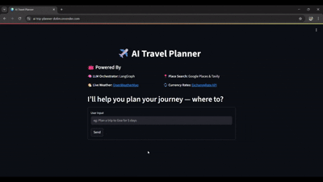

# ✈️ AI Travel Planner - Agentic AI Application

This is an **AI-powered travel planner** that helps you design detailed trip plans using live data and intelligent agents. It provides day-by-day itineraries, weather, places to visit, hotel and restaurant suggestions, budgeting, and more — all in one go!


---

## 🎬 Demo



## 🚀 Features

- 🧠 **LLM Agent Orchestration** with [LangGraph](https://github.com/langchain-ai/langgraph)
- 💬 **Multi-Tool Integration** with tools like:
  - 🌦️ **Live Weather** from [OpenWeatherMap](https://openweathermap.org/)
  - 📍 **Place Information** from [Google Places](https://developers.google.com/maps/documentation/places/web-service/overview) and [Tavily](https://www.tavily.com/)
  - 💱 **Currency Conversion** via [ExchangeRate-API](https://www.exchangerate-api.com/)
  - 🧾 **Expense Calculation** and Budget Planning
- 📋 **Agentic Workflow**: The app intelligently chooses tools to get real-time data
- 📄 **Comprehensive Markdown Output**: Clean, human-readable travel plans

---

## 🛠️ Tech Stack

| Component          | Technology                          |
|--------------------|-------------------------------------|
| Orchestration      | `LangGraph`, `LangChain`            |
| Language Models    | `OpenAI`, `DeepSeek`                |
| Weather Data       | `OpenWeatherMap API`                |
| Place Search       | `Google Places API`, `Tavily`       |
| Currency Conversion| `ExchangeRate-API`                  |
| UI Layer           | `Streamlit`                         |
| Backend API        | `FastAPI` (via `main.py`)           |

---

## 🗂️ Folder Structure

```
AI-Trip-Planner/
│
├── main.py                          # FastAPI backend entry point
├── streamlit_app.py                 # Streamlit frontend entry point
├── README.md                        # Project documentation
├── requirements.txt                 # Python dependencies
├── .env                             # Environment variables (API keys)
├── setup.py                         # Project setup or uv installation guide
├── .gitignore                       # Files/folders to ignore by Git
├── .python-version                  # Python version pinned via uv
├── pyproject.toml                   # Project metadata and config
├── react_graph.png                  # LangGraph flow diagram
├── Dockerfile                       # Containerization of app
│
├── agent/
│   ├── __init__.py                  # Init file for modular imports
│   └── agentic_workflow.py          # LangGraph workflow logic
│
├── config/
│   ├── __init__.py                  # Init file for modular imports
│   └── config.yaml                  # LLM & model configuration
│
├── notebook/
│   └── experiments.ipynb            # Jupyter notebook for testing and prototyping
│
├── prompt_library/
│   ├── __init__.py                  # Init file for modular imports
│   └── prompt.py                    # System prompts for LLM guidance
│
├── tools/
│   ├── __init__.py
│   ├── arithmetic_operation_tool.py # Math utilities (add, multiply)
│   ├── currency_conversion_tool.py  # Currency conversion tool using APIs
│   ├── expense_calculator_tool.py   # Budget and expense breakdown tools
│   ├── place_search_tool.py         # Search tool (Tavily, Google Places)
│   └── weather_info_tool.py         # Weather tool (OpenWeather API)
│
└── utils/
    ├── __init__.py
    ├── config_loader.py             # Load YAML configs
    ├── currency_converter.py        # Core logic for exchange rate
    ├── expense_calculator.py        # Core logic for budgeting
    ├── model_loader.py              # Load OpenAI, Groq, DeepSeek, etc.
    ├── place_info_search.py         # Place search integration logic
    └── weather_info.py              # Weather data integration
```

---

## 🧰 Setup Instructions

1. **Clone the Repository**

   ```bash
   git clone https://github.com/Adonpm/AI-Trip-Planner.git
   cd ai-trip-planner
   ```

2. **Install Dependencies**

   ```bash
   uv pip install -r requirements.txt
   ```

3. **Configure `.env` file**

   Create a `.env` file and add:

   ```env
   OPENWEATHERMAP_API_KEY=your_openweathermap_key
   ALPHAVANTAGE_API_KEY=your_alpha_vantage_key
   GPLACES_API_KEY=your_google_places_key
   TAVILY_API_KEY=your_tavily_key
   OPENAI_API_KEY=your_openai_key
   GROQ_API_KEY=your_groq_key
   EXCHANGE_RATE_API_KEY=your_exchangerate_key
   LANGCHAIN_API_KEY=your_langchain_key
   LANGCHAIN_PROJECT=your_langchain_project_name
   LANGCHAIN_TRACING_V2="true"
   ```

4. **Run Backend**

   ```bash
   uvicorn main:app --port 8000 --reload
   ```

5. **Run Streamlit Frontend**

   ```bash
   streamlit run streamlit_app.py
   ```

---

## ✅ Example Prompt

```
Plan a 5-day budget trip to Goa with hotel suggestions, food, and activities
```

---

## 🚀 Deployment

This project is containerized with Docker and deployed on Render for seamless scalability and easy deployment.

---

## 📎 License

This project is licensed under the **MIT License**.

---

## 🙌 Acknowledgments

- [LangGraph](https://github.com/langchain-ai/langgraph)
- [Streamlit](https://streamlit.io/)
- [OpenWeatherMap](https://openweathermap.org/)
- [Tavily](https://www.tavily.com/)
- [Google Places API](https://developers.google.com/maps/documentation/places)

---

> Built with ❤️ by [Adon Mathew](https://github.com/Adonpm)
